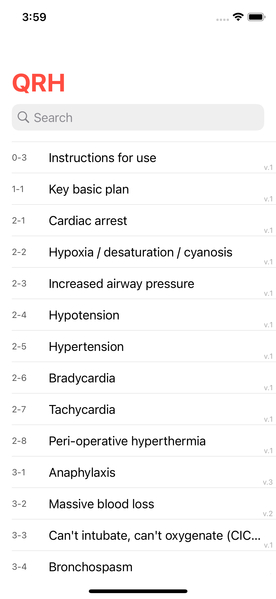
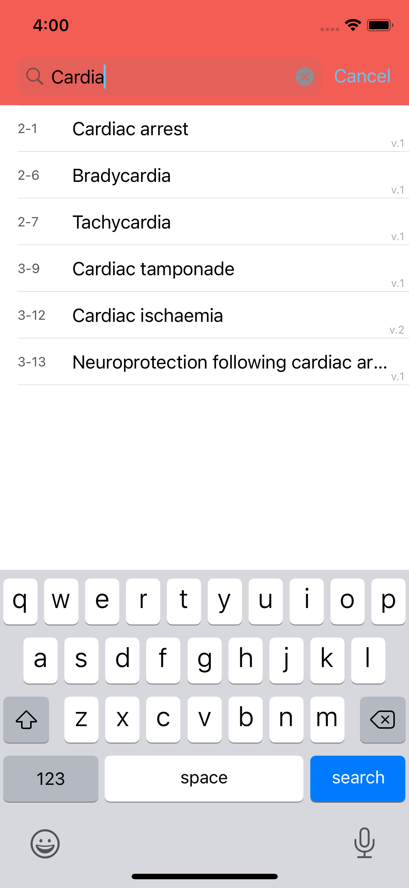
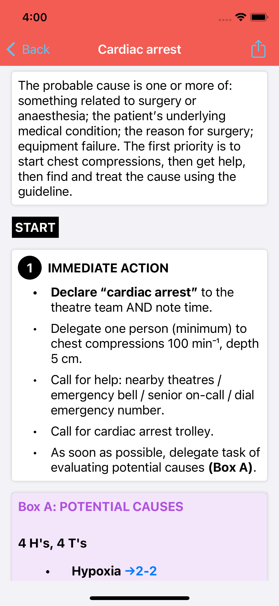
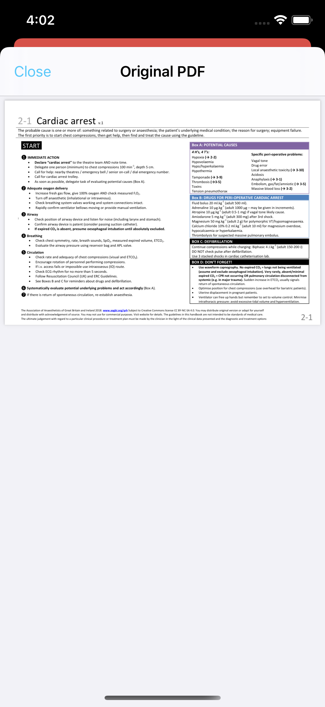

# Quick Reference Handbook (QRH)

 |  |  | 

## Features
- Unofficial derivative of the Association of Anaesthetists Quick Reference Handbook (QRH): www.anaesthetists.org/qrh (CC BY-NC-SA 4.0)
- iOS port of https://github.com/mttrnd/qrh_android

## License
This work is licensed under a [Creative Commons Attribution-NonCommercial-ShareAlike 4.0
International License][cc-by-nc-sa].

[![CC BY-NC-SA 4.0][cc-by-nc-sa-image]][cc-by-nc-sa]

[cc-by-nc-sa]: http://creativecommons.org/licenses/by-nc-sa/4.0/
[cc-by-nc-sa-image]: https://licensebuttons.net/l/by-nc-sa/4.0/88x31.png
[cc-by-nc-sa-shield]: https://img.shields.io/badge/License-CC%20BY--NC%20SA%204.0-lightgrey.svg
You may distribute original version or adapt for yourself and distribute with acknowledgement of source. 
You may not use for commercial purposes.  
